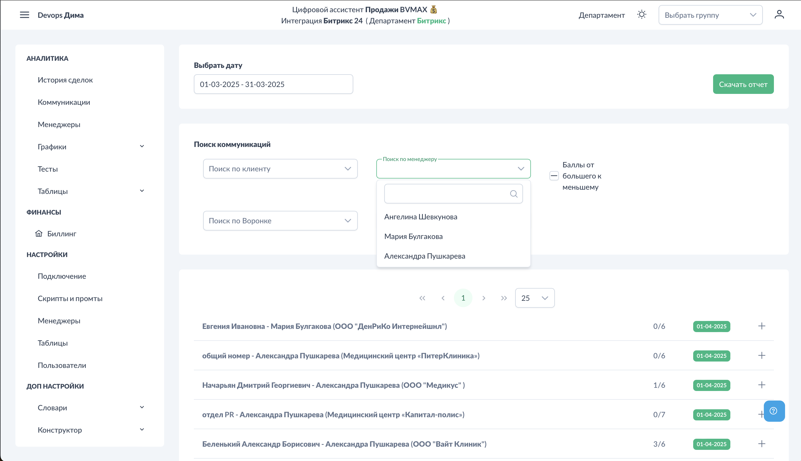
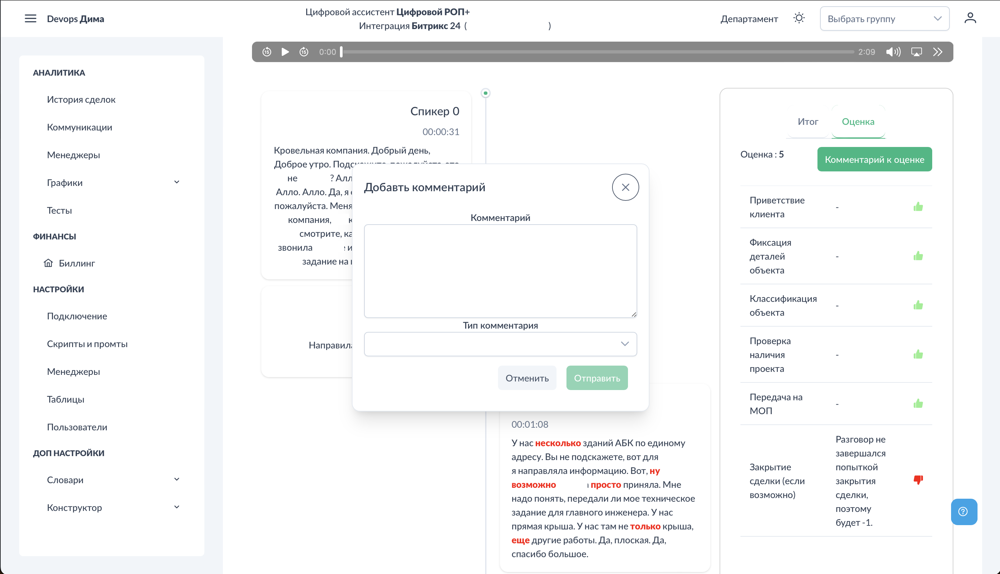

# Аналитика - Коммуникации

Раздел "Коммуникации" — это главный экран для просмотра и анализа всех обработанных звонков. Здесь отображаются результаты оценки, транскрипции и детальная информация по каждому разговору.

## Доступ к разделу

!!! interface "Интерфейс"
    Перейдите в **Аналитика → Коммуникации**.

<figcaption>Коммуникации. Общий вид.png</figcaption>

На экране отображается таблица всех звонков с фильтрами и возможностью детального просмотра.

## Выбор департамента

!!! interface "Интерфейс"
    В правом верхнем углу выберите департамент. Это важно:

- Отображаются только звонки выбранного департамента
- Видно количество звонков в каждом департаменте
- Отображаются только департаменты, где есть звонки
- Звонки без департамента попадают в категорию "Другое"

!!! technical "Техническое"
    Если вы руководитель с подчинёнными департаментами — вы видите звонки всех подчинённых.

## Фильтры

Система фильтрации позволяет найти нужные звонки:

### Фильтр по дате

<figcaption>Коммуникации. Фильтр по дате.png</figcaption>

!!! interface "Интерфейс"
    Выберите период для отображения звонков. По умолчанию — последние 7 дней.

### Фильтр по клиенту

<figcaption>Коммуникации. Фильтр по клиенту.png</figcaption>

!!! interface "Интерфейс"
    Поиск звонков по имени клиента или номеру телефона.

### Фильтр по менеджеру

<figcaption>Коммуникации. Фильтр по менеджеру.png</figcaption>

!!! interface "Интерфейс"
    Выберите конкретного менеджера для просмотра его звонков.

### Фильтр по воронке

<figcaption>Коммуникации. Фильтр по воронке.png</figcaption>

!!! interface "Интерфейс"
    Выберите воронку CRM.

### Фильтр по стадии

<figcaption>Коммуникации. Фильтр по стадии.png</figcaption>

!!! interface "Интерфейс"
    После выбора воронки становится доступен фильтр по стадии.

### Сортировка

<figcaption>Коммуникации. Сортировка.png</figcaption>

!!! interface "Интерфейс"
    Чекбокс "От большего к меньшему" сортирует звонки по оценке — сначала лучшие или худшие результаты.

## Таблица звонков

!!! interface "Интерфейс"
    Таблица содержит основную информацию:

- **Дата и время** — когда был звонок
- **Менеджер** — кто разговаривал
- **Клиент** — имя или номер
- **Длительность** — продолжительность разговора
- **Оценка** — результат в формате X/Y (набрано/максимум)

## Детали звонка

<figcaption>Коммуникации. Детали звонка.png</figcaption>

!!! interface "Интерфейс"
    При клике на строку таблицы открывается детальный просмотр звонка:

### Левая панель: Транскрипция и аудио

- **Аудиоплеер** — прослушивание записи с управлением воспроизведением
- **Транскрипция** — текст разговора с разделением по спикерам
- **Временные метки** — для навигации по записи

!!! technical "Техническое"
    Слова-паразиты (если настроены) подсвечиваются красным цветом в тексте транскрипции.

### Правая панель: Оценка

<figcaption>Коммуникации. Оценка звонка.png</figcaption>

!!! interface "Интерфейс"
    Детальные результаты проверки по чек-листу:

- **Выполненные этапы** — зелёный индикатор, +1 балл
  - Цитаты из разговора, подтверждающие выполнение

- **Невыполненные этапы** — красный индикатор, -1 балл
  - Объяснение, почему не засчитано
  - Рекомендации по улучшению

- **Процент выполнения** — для каждого этапа показывается степень соответствия

## Комментарии

<figcaption>Коммуникации. Комментарий.png</figcaption>

!!! interface "Интерфейс"
    Под каждым звонком можно оставить комментарий:

- Заметки руководителя
- Обратная связь менеджеру
- Пометки для себя

Комментарии сохраняются и видны при повторном просмотре.

## Экспорт данных

!!! interface "Интерфейс"
    Кнопка "Скачать отчёт" в верхней части страницы экспортирует данные в Excel:

- Учитываются все применённые фильтры
- Включена расширенная информация по каждому звонку
- Детальные оценки по всем этапам чек-листа

## Важные замечания

- Объём доступных данных зависит от вашей роли:
  - **Менеджер** — только свои звонки
  - **Руководитель** — звонки своего подразделения
  - **Администратор** — все звонки компании

- Короткие звонки (менее установленного порога) могут не отображаться

## См. также

- [Аналитика - История сделок](../analytics/deals-history.md) — группировка по карточкам
- [Аналитика - Менеджеры](../analytics/managers.md) — сводная статистика
- [Тесты](../tests/index.md) — обучение на основе ошибок
- [Шаблоны скриптов](../settings/scripts-templates.md) — настройка критериев оценки
