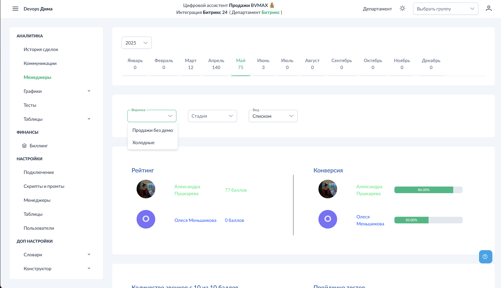
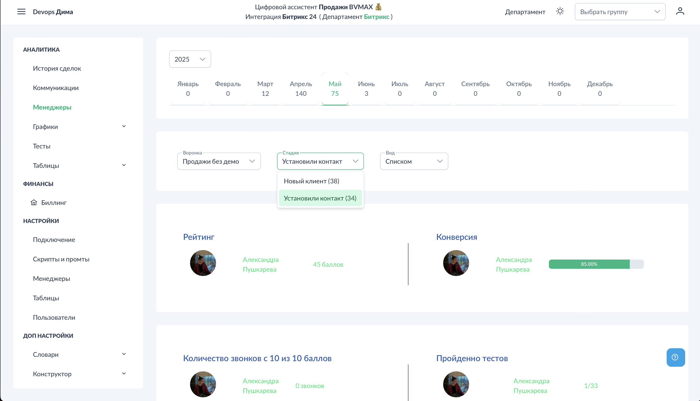

# Аналитика - Менеджеры

Раздел "Менеджеры" показывает сводную статистику по каждому сотруднику: рейтинг, конверсию, количество звонков и прогресс по тестам.

## Доступ к разделу

!!! interface "Интерфейс"
    Перейдите в **Аналитика → Менеджеры**.

<figcaption>Менеджеры. Общий вид.png</figcaption>

На экране отображается список менеджеров с ключевыми показателями.

## Фильтры

### Воронка и стадия

<figcaption>Менеджеры. Фильтр воронка.png</figcaption>

<figcaption>Менеджеры. Фильтр стадия.png</figcaption>

!!! interface "Интерфейс"
    Выберите воронку, затем стадию для просмотра статистики по конкретному этапу продаж.

### Вид отображения

!!! interface "Интерфейс"
    Переключатель "Вид":

- **Карточки** — визуальное представление с аватарами
- **Таблица** — компактный табличный вид

<figcaption>Менеджеры. Общий вид 2.png</figcaption>

<figcaption>Менеджеры. Вид таблица.png</figcaption>

## Показатели

!!! interface "Интерфейс"
    Для каждого менеджера отображается:

### Рейтинг

!!! technical "Техническое"
    Сумма выполненных этапов по всем звонкам. Считаются только положительные баллы (+1), отрицательные (-1) не вычитаются.

**Пример расчёта:**
- Звонок 1: оценка 4/5 → в рейтинг идёт 4 балла
- Звонок 2: оценка 2/5 → в рейтинг идёт 2 балла
- **Итого рейтинг: 6 баллов**

### Конверсия

!!! technical "Техническое"
    Процент звонков, отмеченных как конверсия. Рассчитывается на основе [настроенного промта конверсии](#настройки-конверсия).

### Звонков 10/10

!!! interface "Интерфейс"
    Количество идеальных звонков — где выполнены все этапы чек-листа на 100%.

### Тесты

!!! interface "Интерфейс"
    Статистика по тестам: сколько сформировано / сколько пройдено.

## Переход к детальной информации

!!! interface "Интерфейс"
    При клике на карточку менеджера открывается фильтрованный список его звонков в разделе [Коммуникации](#аналитика-коммуникации).

## Применение

Раздел полезен для:

1. **Сравнения менеджеров** — кто работает лучше/хуже
2. **Выявления лидеров** — примеры для обучения
3. **Определения зон роста** — кому нужна помощь
4. **Контроля обучения** — прогресс по тестам

## См. также

- [Графики - Менеджеры](../charts/managers.md) — визуализация динамики
- [Аналитика - Коммуникации](../analytics/communications.md) — детали по звонкам
- [Тесты](../tests/index.md) — система обучения
- [Настройка конверсии](../settings/conversion.md) — критерии успеха
