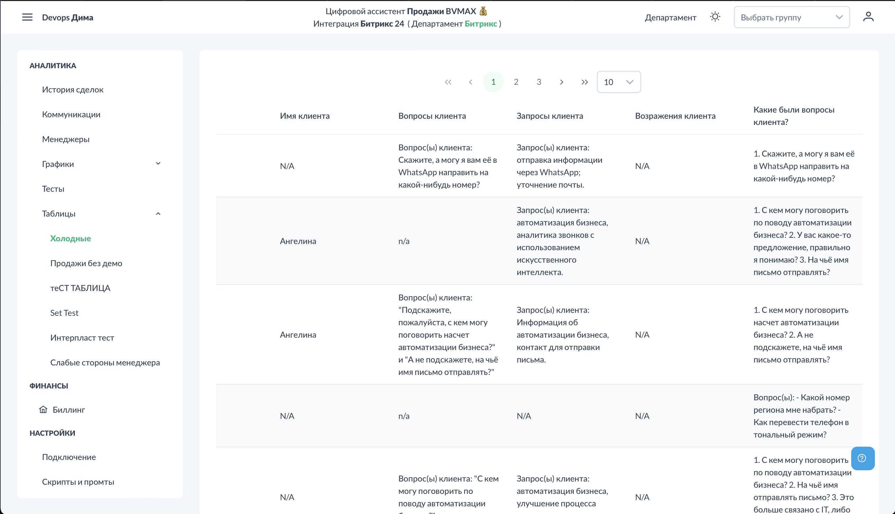

# Аналитика - Таблицы

В разделе "Таблицы" отображаются результаты кастомной аналитики, настроенной в [Настройки → Таблицы](../settings/tables.md).

## Доступ к разделу

!!! interface "Интерфейс"
    Перейдите в **Аналитика → Таблицы**.

<figcaption>Таблицы. Результат аналитики.png</figcaption>

## Выбор таблицы

!!! interface "Интерфейс"
    В левой части экрана отображается список созданных таблиц. Нажмите на название таблицы для просмотра данных.

## Структура данных

!!! interface "Интерфейс"
    Таблица содержит:

- **Дата звонка** — когда был разговор
- **Название звонка** — кликабельная ссылка на детали
- **Ваши поля** — колонки с результатами ИИ-анализа

!!! technical "Техническое"
    Каждая строка — один звонок. Для каждого звонка ИИ анализирует транскрипцию и заполняет поля согласно настроенным промтам.

## Фильтрация и сортировка

!!! interface "Интерфейс"
    Используйте стандартные инструменты таблицы:

- Сортировка по колонкам
- Фильтрация по значениям
- Поиск по содержимому

## Экспорт данных

!!! interface "Интерфейс"
    Кнопка "Скачать" экспортирует таблицу в Excel для:

- Дальнейшего анализа
- Построения графиков
- Отчётности
- Интеграции с другими системами

## Примеры использования

### Таблица "География клиентов"
| Дата | Звонок | Город | Регион |
|------|--------|-------|--------|
| 01.12 | Звонок #123 | Москва | Центральный |
| 01.12 | Звонок #124 | Казань | Поволжье |

### Таблица "Возражения"
| Дата | Звонок | Возражение | Как отработано |
|------|--------|------------|----------------|
| 01.12 | Звонок #125 | Дорого | Предложена рассрочка |
| 01.12 | Звонок #126 | Нет времени | Назначен callback |

## Важные замечания

- Данные появляются только по **новым звонкам** после настройки таблицы
- При добавлении нового поля старые звонки **не пересчитываются**
- Для изменения структуры таблицы используйте [Настройки → Таблицы](../settings/tables.md)

## См. также

- [Настройки - Таблицы](../settings/tables.md) — создание и настройка таблиц
- [Аналитика - Коммуникации](../analytics/communications.md) — детали звонков
- [Дополнительные промты](../settings/additional-prompts.md) — альтернативный способ сбора данных
