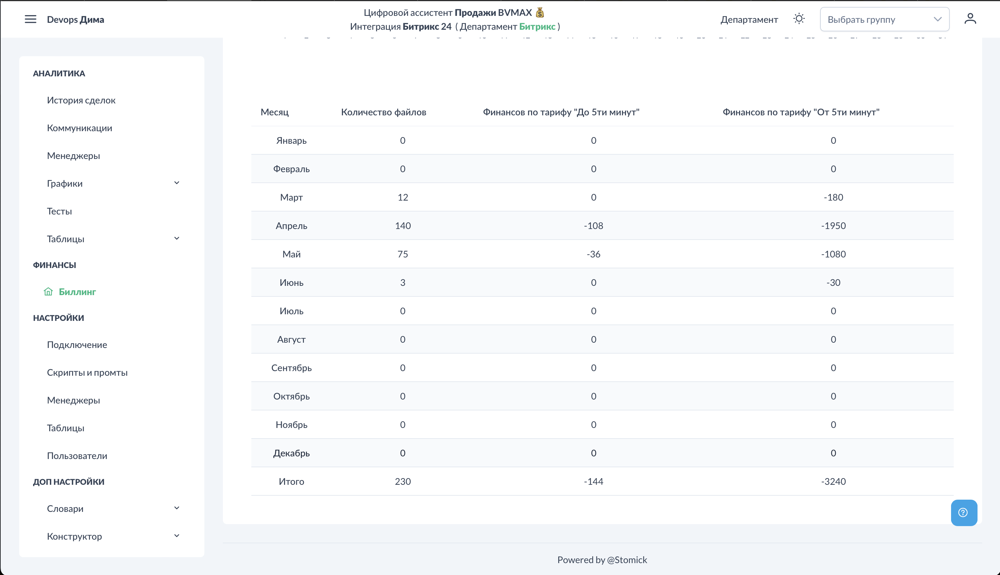

# Биллинг

Раздел "Биллинг" показывает статистику использования платформы: количество обработанных файлов и расход средств.

## Доступ к разделу

!!! interface "Интерфейс"
    Перейдите в **Биллинг**.

<figcaption>Биллинг. Общий вид.png</figcaption>

## Основные показатели

!!! interface "Интерфейс"
    На главном экране отображается:

- **Всего файлов** — сколько аудиофайлов поступило в систему
- **Обработано** — сколько файлов успешно обработано
- **Баланс** — текущий баланс аккаунта
- **Израсходовано** — сколько средств потрачено

## Графики

<figcaption>Биллинг. Графики.png</figcaption>

!!! interface "Интерфейс"
    Визуализация динамики:

- Количество файлов по дням/неделям
- Расход средств по периодам

## Детализация

<figcaption>Биллинг. Таблица.png</figcaption>

!!! interface "Интерфейс"
    Таблица с детальной информацией:

- Дата обработки
- Количество файлов
- Стоимость

## Пополнение баланса

!!! interface "Интерфейс"
    Для пополнения баланса свяжитесь с поддержкой:

- Telegram: @tchashchin
- Телефон: +79670047879

## См. также

- [Что такое Цифровой РОП](../start/about.md) — возможности платформы
- [FAQ](../faq.md) — часто задаваемые вопросы
