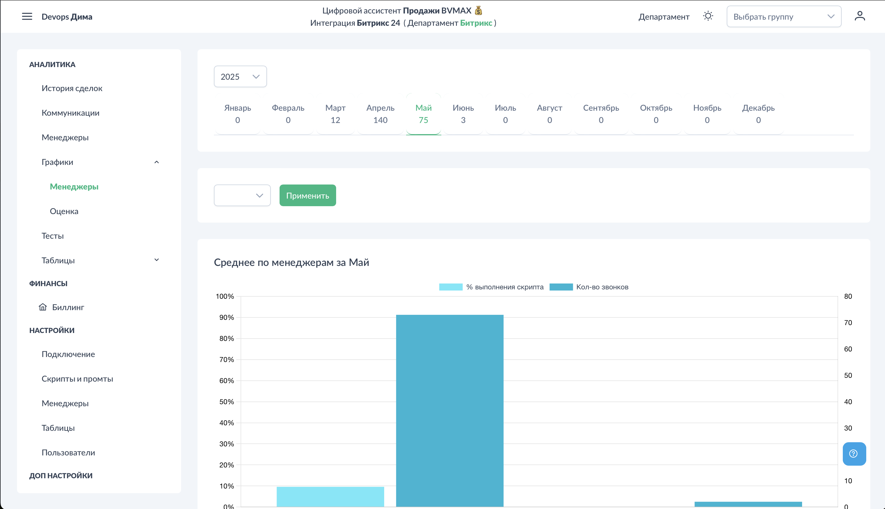

# Графики - Менеджеры

Раздел показывает динамику работы менеджеров: средние оценки, соблюдение скрипта и конверсию в виде тепловых карт.

## Доступ к разделу

!!! interface "Интерфейс"
    Перейдите в **Графики → Менеджеры**.

<figcaption>Графики Менеджеры. Общий вид.png</figcaption>

## Фильтры

!!! interface "Интерфейс"
    Доступные фильтры:

- **Месяц** — выбор периода для анализа
- **Менеджер** — мультиселектор для фильтрации по конкретным сотрудникам

## Графики

<figcaption>Графики Менеджеры. Динамика и конверсия.png</figcaption>

### Средний балл по менеджерам

!!! interface "Интерфейс"
    Столбчатая диаграмма со средней оценкой каждого менеджера за выбранный месяц.

### Процент выполнения скрипта

!!! interface "Интерфейс"
    Показывает, какой процент этапов в среднем выполняет каждый менеджер.

### Тепловая карта: Динамика соблюдения скрипта

!!! interface "Интерфейс"
    Матрица "Менеджеры × Дни месяца" с цветовой индикацией:

- **Тёмные ячейки** — высокие баллы
- **Светлые ячейки** — низкие баллы

!!! technical "Техническое"
    Для каждого дня суммируются баллы менеджера по всем звонкам. Логика подсчёта — как в рейтинге: только положительные баллы (+1).

### Тепловая карта: Конверсия

!!! interface "Интерфейс"
    Аналогичная матрица для конверсии:

- Показывает конверсию по дням для каждого менеджера
- Помогает выявить паттерны (дни недели, периоды спада)

## Применение

1. **Мониторинг динамики** — как менялось качество работы в течение месяца
2. **Выявление паттернов** — есть ли "плохие" дни недели или периоды
3. **Сравнение менеджеров** — кто стабильно работает, кто "плавает"
4. **Оценка эффекта мероприятий** — как повлияло обучение/совещание на показатели

## См. также

- [Графики - Оценка](../charts/score.md) — общая статистика по чек-листу
- [Аналитика - Менеджеры](../analytics/managers.md) — числовые показатели
- [Настройка конверсии](../settings/conversion.md) — критерии конверсии
