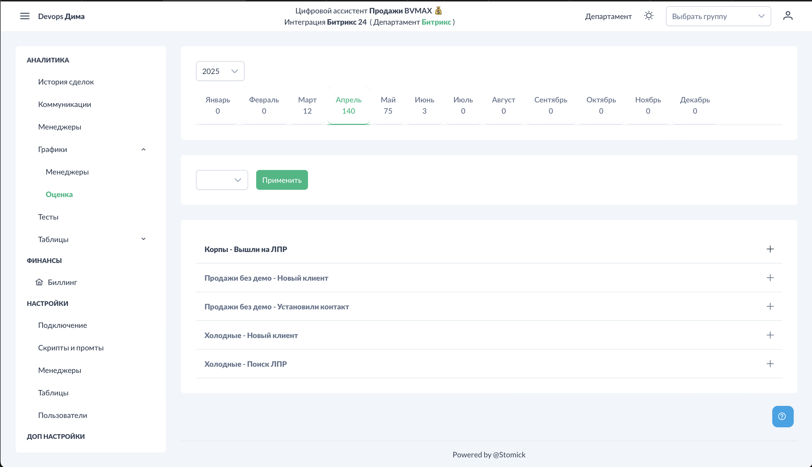

# Графики - Оценка

Раздел визуализирует данные по оценке звонков: общее количество, процент обработки и соблюдение чек-листа по этапам.

## Доступ к разделу

!!! interface "Интерфейс"
    Перейдите в **Графики → Оценка**.

<figcaption>Графики Оценка. Общий вид.png</figcaption>

## Фильтры

!!! interface "Интерфейс"
    Доступные фильтры:

- **Воронка** — выбор воронки CRM
- **Стадия** — выбор стадии (после выбора воронки)
- **Менеджер** — мультиселектор для выбора нескольких менеджеров

## График: Всего звонков vs Обработано

<figcaption>Графики Оценка. Всего звонков.png</figcaption>

!!! interface "Интерфейс"
    Показывает соотношение общего количества звонков и обработанных системой.

!!! technical "Техническое"
    Разница между "Всего" и "Обработано" — это звонки, которые не прошли фильтрацию:

- Слишком короткие (менее установленного порога)
- Прерванные
- Технические проблемы с записью

## График: Соблюдение чек-листа

<figcaption>Графики Оценка. Соблюдение чеклиста.png</figcaption>

!!! interface "Интерфейс"
    Для каждого этапа чек-листа показывается:

- **Процент выполнения** — сколько менеджеров соблюдают этап
- **Процент отклонения** — сколько не выполняют

!!! technical "Техническое"
    График помогает выявить:

- Самые проблемные этапы (низкий процент выполнения)
- Этапы, требующие дополнительного обучения
- Эффективность скрипта в целом

## Применение

1. **Выявление слабых мест** — какие этапы скрипта чаще всего не выполняются
2. **Оценка эффективности обучения** — как меняется соблюдение после тренингов
3. **Корректировка скрипта** — возможно, некоторые этапы слишком сложные или нерелевантные
4. **Отчётность руководству** — визуальная демонстрация качества работы

## См. также

- [Графики - Менеджеры](../charts/managers.md) — статистика по сотрудникам
- [Аналитика - Коммуникации](../analytics/communications.md) — детали звонков
- [Шаблоны скриптов](../settings/scripts-templates.md) — настройка этапов
