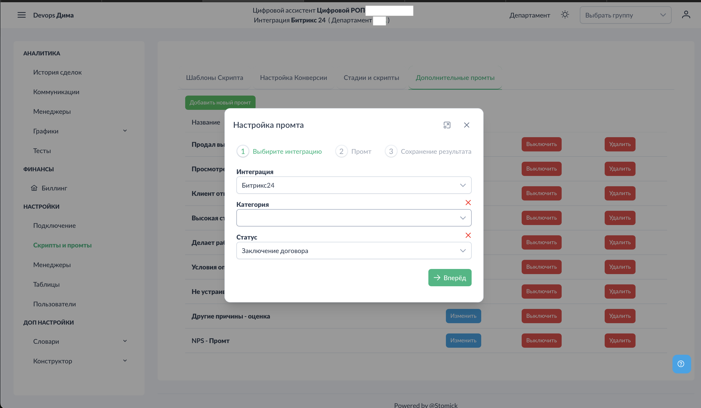
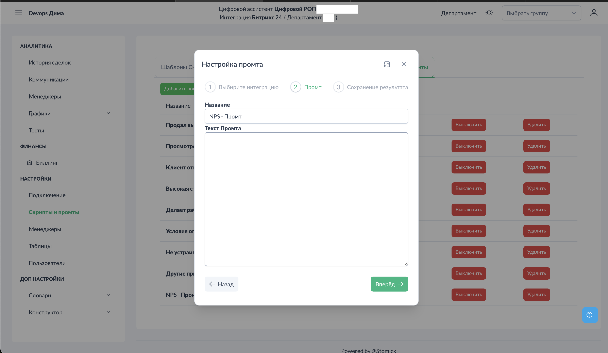
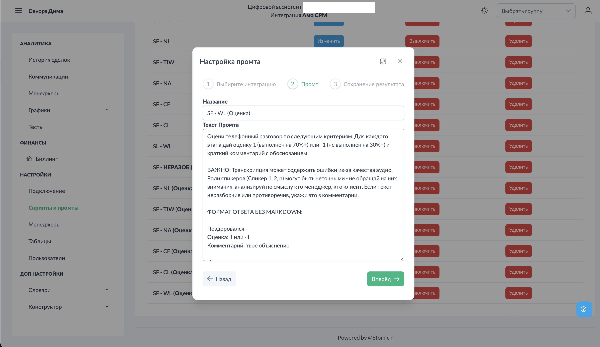
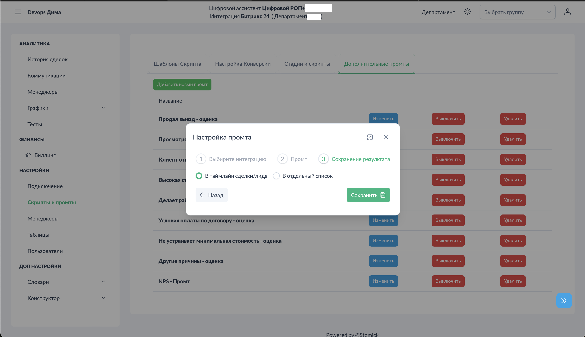
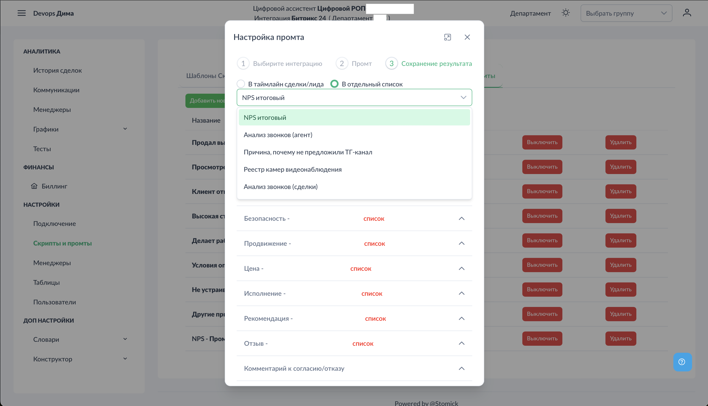
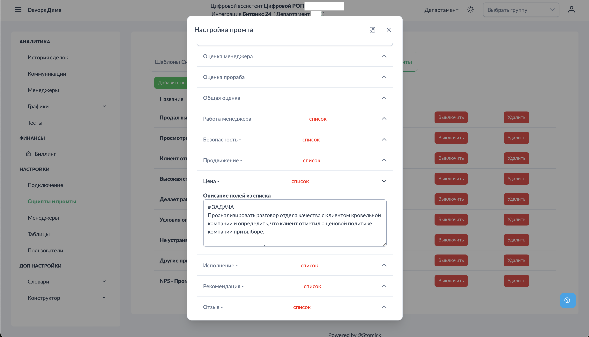

# Настройки - Дополнительные промты

Дополнительные промты позволяют извлекать из звонков любую информацию помимо стандартной оценки по чек-листу. Результаты можно сохранять в CRM.

## Доступ к разделу


!!! interface "Интерфейс"
    Перейдите в **Настройки → Скрипты и промты → Дополнительные промты**.


<figcaption>Дополнительные промты. Общий вид.png</figcaption>


На экране отображается список созданных промтов с возможностью включения/выключения каждого.

## Создание промта

### Шаг 1: Добавление нового промта


!!! interface "Интерфейс"
    Нажмите кнопку "Добавить промт".



<figcaption>Дополнительные промты. Выбор источника.png</figcaption>


Выберите:
- **Интеграция** — Битрикс24, AmoCRM или MacroCRM (зависит от подключённой системы)
- **Воронка** — для какой воронки применяется промт
- **Стадия** — для какой стадии применяется промт


!!! technical "Техническое"
    Для телефоний (Новофон, МТС) и Яндекс Диска воронки и стадии настраиваются в разделе [Скрипты и промты](#настройки-скрипты-и-промты).


### Шаг 2: Настройка промта



<figcaption>Дополнительные промты. Пустой промт.png</figcaption>


!!! interface "Интерфейс"
    Заполните:

- **Название промта** (обязательно) — например, "Ключевые моменты", "Возражения клиента"
- **Текст промта** — что нужно извлечь из звонка



<figcaption>Дополнительные промты. Заполненный промт.png</figcaption>


**Примеры промтов:**

```
Выпиши ключевые моменты звонка в виде списка
```

```
Какие возражения высказал клиент?
Если возражений не было, напиши "Возражений не было"
```

```
Какой продукт интересовал клиента?
Формат ответа: название продукта
```

### Шаг 3: Выбор места сохранения



<figcaption>Дополнительные промты. Выбор куда сохранять.png</figcaption>


!!! interface "Интерфейс"
    Выберите, куда сохранять результат промта:


#### Вариант A: Комментарий к сделке/лиду


<figcaption>Дополнительные промты. Комментарий Амо.png</figcaption>


!!! technical "Техническое"
    Результат промта добавляется в таймлайн карточки сделки или лида в CRM. Это удобно для быстрого просмотра ключевой информации менеджером.


**Требования:**
- Текст промта обязателен
- Промт должен быть включён

#### Вариант B: Отдельный список (Битрикс24)



<figcaption>Дополнительные промты. Список Битрикс.png</figcaption>


!!! technical "Техническое"
    Результаты сохраняются в отдельный список Битрикс24. Это удобно для структурированного сбора данных и последующего анализа. Для AmoCRM и MacroCRM доступны аналогичные возможности сохранения в поля сделки.



<figcaption>Дополнительные промты. Промт для списка.png</figcaption>


!!! interface "Интерфейс"
    При выборе списка:

1. Выберите список из выпадающего меню
2. Для каждого поля списка напишите свой промт

**Пример для поля "Отзыв":**
```
Какой отзыв о компании оставил клиент?
Если клиент не оставлял отзыв, напиши "Не указано"
```

**Рекомендация:** Создайте отдельный список специально для аналитики Цифрового РОП, чтобы не смешивать с другими бизнес-процессами.

## Включение промта


!!! interface "Интерфейс"
    После создания промта обязательно нажмите кнопку "Включить" в списке промтов. Без этого промт не будет обрабатываться.


!!! technical "Техническое"
    Промты обрабатываются последовательно для каждого звонка. Слишком много активных промтов может замедлить обработку.


## Важные замечания

- Промты применяются только к **новым звонкам**
- Результаты видны в CRM после завершения обработки звонка
- Если промт выключен — обработка не происходит
- Рекомендуется не создавать более 5-7 активных промтов

## Примеры использования

1. **Сбор отзывов** — автоматическое извлечение обратной связи от клиентов
2. **Анализ возражений** — понимание типичных препятствий в продажах
3. **Классификация звонков** — определение темы или типа обращения
4. **Извлечение контактов** — сбор дополнительных данных о клиенте

## См. также

- [Настройки - Таблицы](../settings/tables.md) — альтернативный способ сбора кастомной аналитики
- [Аналитика - Коммуникации](../analytics/communications.md) — просмотр результатов
- [Шаблоны скриптов](../settings/scripts-templates.md) — основная оценка звонков
