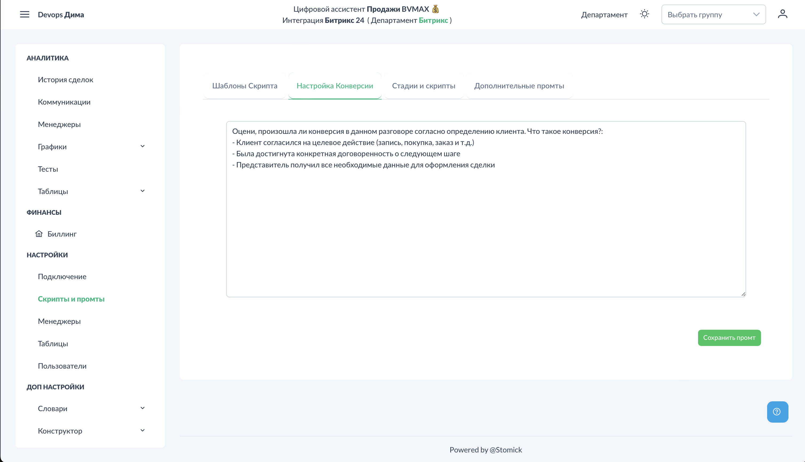

# Настройки - Конверсия

Настройка конверсии позволяет системе определять, привёл ли звонок к желаемому результату. Каждый звонок проверяется на конверсию и получает отметку: 1 (конверсия) или 0 (нет конверсии).

## Доступ к разделу


!!! interface "Интерфейс"
    Перейдите в **Настройки → Скрипты и промты → Настройка конверсии**.



<figcaption>Настройка конверсии. Общий вид.png</figcaption>


## Что такое конверсия


!!! technical "Техническое"
    Конверсия — это достижение цели звонка. Для разных бизнесов конверсия может означать разное:

- Согласие на встречу
- Оформление заказа
- Запись на консультацию
- Получение контактных данных
- Переход на следующий этап воронки

## Настройка промта конверсии


!!! interface "Интерфейс"
    В системе есть базовый промт конверсии, предзаполненный по умолчанию. Вы можете настроить его под свою компанию.


Напишите своими словами, что для вас является конверсией:

**Пример для недвижимости:**
```
Конверсия — это когда клиент согласился на просмотр объекта
или записался на встречу с менеджером.
```

**Пример для интернет-магазина:**
```
Конверсия — это когда клиент оформил заказ,
подтвердил заказ или согласился на доставку.
```

**Пример для B2B:**
```
Конверсия — это когда клиент согласился на демонстрацию продукта,
запросил коммерческое предложение или назначил встречу.
```

## Как работает проверка


!!! technical "Техническое"
    После настройки система автоматически:

1. Анализирует транскрипцию каждого звонка
2. Проверяет на соответствие критериям конверсии
3. Присваивает результат: 1 или 0
4. Сохраняет в аналитику

Результаты конверсии отображаются:
- В карточке каждого звонка ([Коммуникации](../analytics/communications.md))
- В статистике менеджеров ([Менеджеры](../analytics/managers.md))
- На графиках ([Графики - Менеджеры](../charts/managers.md))

## Рекомендации по настройке

1. **Будьте конкретны** — избегайте размытых формулировок
2. **Учитывайте специфику бизнеса** — конверсия должна отражать реальные цели
3. **Используйте простой язык** — ИИ лучше понимает чёткие критерии
4. **Тестируйте** — проверьте результаты на нескольких звонках

## Анализ конверсии

После настройки конверсия отображается в разделах:
- [Аналитика - Менеджеры](../analytics/managers.md) — процент конверсии по каждому менеджеру
- [Графики - Менеджеры](../charts/managers.md) — тепловая карта конверсии по дням

## См. также

- [Аналитика - Менеджеры](../analytics/managers.md) — статистика конверсии
- [Графики - Менеджеры](../charts/managers.md) — визуализация конверсии
- [Шаблоны скриптов](../settings/scripts-templates.md) — оценка качества звонков
