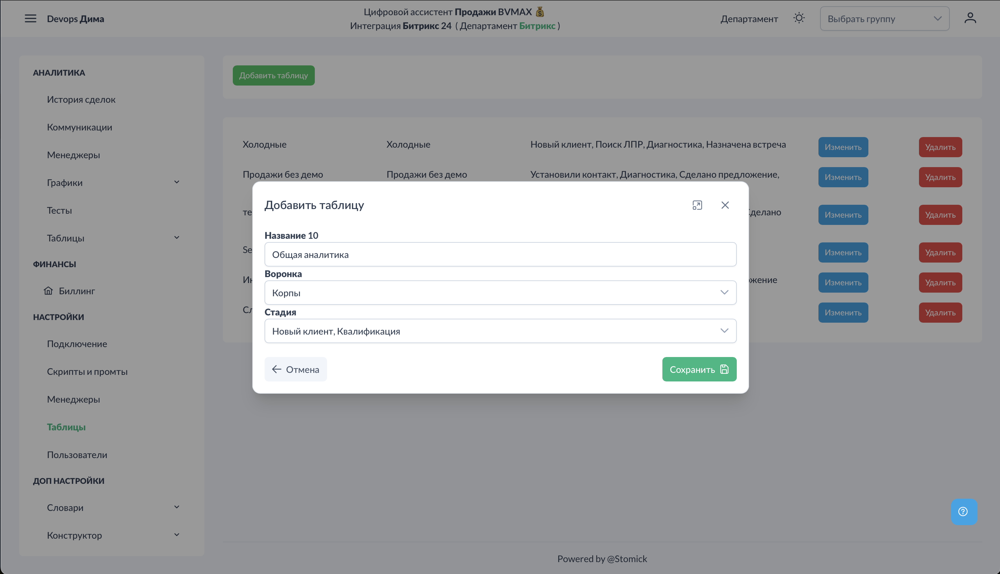
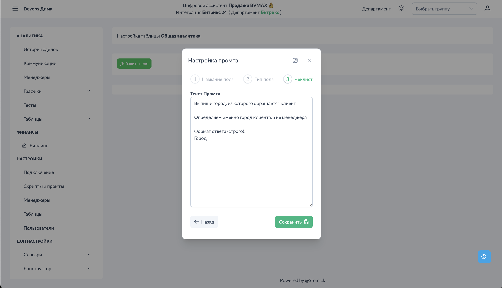
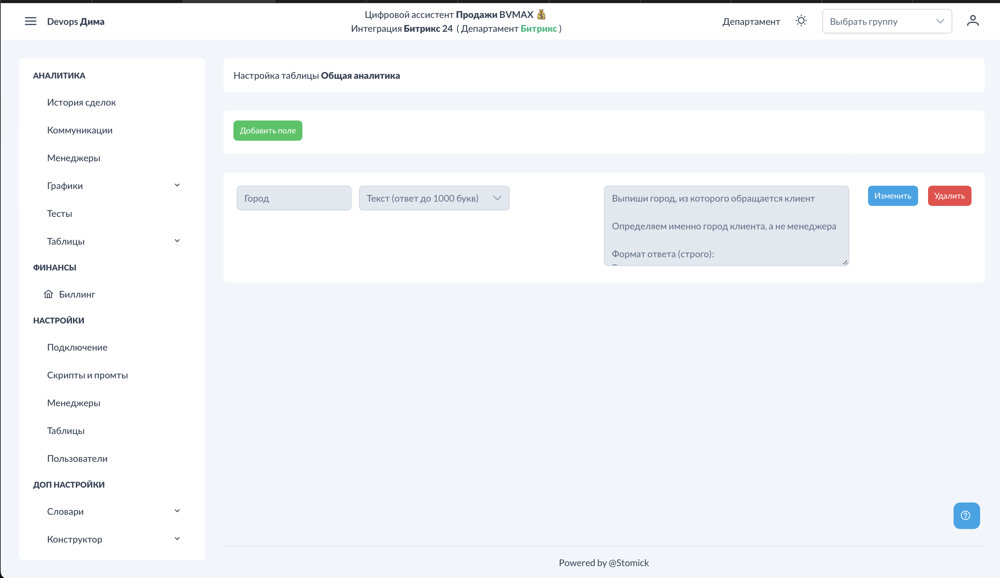

# Настройки - Таблицы

Таблицы позволяют собирать кастомную аналитику по звонкам для последующего просмотра и экспорта. В отличие от дополнительных промтов, результаты сохраняются внутри платформы, а не в CRM.

## Доступ к разделу


!!! interface "Интерфейс"
    Перейдите в **Настройки → Таблицы**.


<figcaption>Таблицы. Общий вид.png</figcaption>


На экране отображается список созданных таблиц.

## Создание таблицы

### Шаг 1: Добавление таблицы



<figcaption>Таблицы. Добавить таблицу.png</figcaption>


!!! interface "Интерфейс"
    Нажмите "Добавить таблицу" и заполните:

- **Название таблицы** — например, "Аналитика возражений", "Данные по городам"
- **Воронка** — из какой воронки собирать данные
- **Стадии** — мультиселектор для выбора нескольких стадий

### Шаг 2: Добавление полей


!!! interface "Интерфейс"
    После создания таблицы нажмите "Изменить" для добавления полей (колонок).


<figcaption>Таблицы. Наименование поля.png</figcaption>


Для каждого поля укажите:

#### Наименование поля
Название колонки в таблице (например, "Город", "Возражение", "Интерес")

#### Тип данных


<figcaption>Таблицы. Тип поля.png</figcaption>


!!! technical "Техническое"
    Выберите тип данных, который должен вернуть ИИ:

- **Текст** — короткий текстовый ответ
- **Длинный текст** — развёрнутый ответ
- **Число** — числовое значение

#### Промт для ИИ



<figcaption>Таблицы. Промт для поля.png</figcaption>


!!! interface "Интерфейс"
    Напишите промт — что ИИ должен извлечь из звонка для этого поля.


**Примеры:**

Поле "Город":
```
Из какого города звонит клиент?
Формат ответа: название города
Если не упоминается — напиши "Не указано"
```

Поле "Бюджет":
```
Какой бюджет озвучил клиент?
Формат ответа: только число
Если не озвучен — напиши "0"
```



<figcaption>Таблицы. Пример поля.png</figcaption>


!!! interface "Интерфейс"
    После заполнения всех данных нажмите "Сохранить".


## Просмотр результатов


<figcaption>Таблицы. Результат аналитики.png</figcaption>


!!! interface "Интерфейс"
    Результаты отображаются в разделе **Аналитика → Таблицы**. Выберите нужную таблицу для просмотра данных.


!!! technical "Техническое"
    Таблица содержит:

- Дату звонка
- Название звонка (ссылка на карточку)
- Все добавленные вами поля с результатами ИИ

## Экспорт данных


!!! interface "Интерфейс"
    Данные таблицы можно скачать в формате Excel для дальнейшего анализа или отчётности.


## Важные замечания


!!! technical "Техническое"
    

- Промты применяются только к **новым звонкам**
- Старые звонки **не пересчитываются** при добавлении новых полей
- Изменение промта в существующем поле влияет только на новые звонки
- Количество полей не ограничено, но рекомендуется не более 10-15 для удобства

## Отличие от дополнительных промтов

| Параметр | Таблицы | Дополнительные промты |
|----------|---------|----------------------|
| Где хранятся данные | В платформе | В CRM |
| Экспорт | Excel из платформы | Через CRM |
| Структура | Табличная | Комментарии/списки |
| Применение | Сбор данных для анализа | Обогащение карточек CRM |

## Примеры использования

1. **Сегментация клиентов** — сбор данных о географии, интересах, бюджетах
2. **Анализ возражений** — структурированный сбор препятствий к покупке
3. **Оценка качества лидов** — квалификация по критериям
4. **Исследования рынка** — сбор обратной связи о продуктах/конкурентах

## См. также

- [Аналитика - Таблицы](../analytics/tables.md) — просмотр результатов
- [Дополнительные промты](../settings/additional-prompts.md) — сохранение в CRM
- [Аналитика - Коммуникации](../analytics/communications.md) — детали звонков
