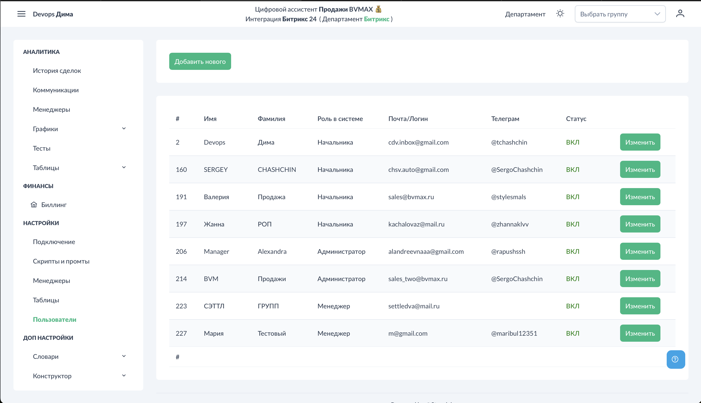
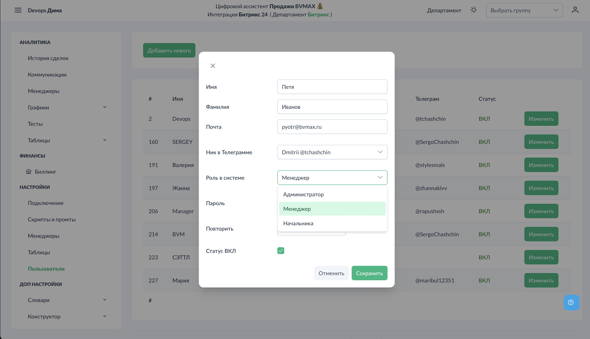

# Настройки - Пользователи

В разделе "Пользователи" добавляются аккаунты для менеджеров и руководителей. Это необходимо для входа в систему, получения тестов и отчётов.

## Доступ к разделу

!!! interface "Интерфейс"
    Перейдите в **Настройки → Пользователи**.

<figcaption>Пользователи. Общий вид.png</figcaption>

На экране отображается список всех пользователей с их ролями и статусами.

## Добавление пользователя

<figcaption>Пользователи. Добавление.png</figcaption>

!!! interface "Интерфейс"
    Нажмите "Добавить пользователя" и заполните форму:

### Основные данные

- **Email** — используется как логин для входа в систему
- **Пароль** — пароль для входа

### Роль пользователя

<figcaption>Пользователи. Настройка роли.png</figcaption>

!!! interface "Интерфейс"
    Выберите роль:

- **Менеджер** — видит только свои звонки и статистику
- **Администратор** — полный доступ ко всем данным и настройкам

### Привязка к менеджеру из CRM

!!! technical "Техническое"
    Выберите имя менеджера из списка сотрудников CRM. Это **критически важно** для:

- Корректного отображения звонков в аналитике
- Формирования и отправки тестов
- Рассылки отчётов

**Важно:** Без привязки к менеджеру из CRM пользователь не будет получать тесты!

### Привязка Telegram

<figcaption>Пользователи. Привязка Telegram.png</figcaption>

!!! interface "Интерфейс"
    Для получения тестов и отчётов привяжите Telegram-аккаунт пользователя.

**Требования для привязки:**
1. Пользователь должен состоять в Telegram-группе компании (где был выполнен /register)
2. Пользователь должен начать диалог с ботом @BVM_Assistant_Bot (нажать /start)

!!! technical "Техническое"
    Только после выполнения обоих условий Telegram-аккаунт появится в списке для привязки.

## Настройки для руководителей

!!! interface "Интерфейс"
    Если пользователь — руководитель, отметьте галочку "Руководитель".

Для руководителей доступны дополнительные опции:
- **Ежедневные отчёты** — Excel-файл со всеми звонками за день в Telegram
- **Еженедельные отчёты** — сводка за неделю (отправляется в пятницу вечером)

!!! technical "Техническое"
    Отчёты содержат:

- Список всех звонков с оценками
- Результаты по всем подчинённым менеджерам
- Данные по настроенным фильтрам

## Редактирование пользователя

!!! interface "Интерфейс"
    Нажмите "Изменить" напротив нужного пользователя для:

- Изменения роли
- Смены пароля
- Привязки/отвязки Telegram
- Включения/выключения отчётов

## Отключение пользователя

!!! interface "Интерфейс"
    Если сотрудник уволен:

1. Откройте редактирование пользователя
2. Установите статус "Выключен"

Выключенный пользователь:
- Не может войти в систему
- Не получает тесты и отчёты
- Остаётся в базе для сохранения истории

## Роли и права доступа

| Возможность | Менеджер | Администратор |
|-------------|----------|---------------|
| Просмотр своих звонков | + | + |
| Просмотр всех звонков | - | + |
| Получение тестов | + | + |
| Управление пользователями | - | + |
| Настройка скриптов | - | + |
| Настройка промтов | - | + |

## Важные замечания

1. **Telegram обязателен** для получения тестов — без привязки тесты не отправляются
2. **Привязка к CRM обязательна** — иначе система не знает, чьи звонки оценивать
3. **Один email = один аккаунт** — дублирование не допускается
4. **Руководитель видит данные подчинённых** — это настраивается через структуру департаментов

## См. также

- [Регистрация и вход](../start/registration.md) — настройка Telegram-группы
- [Тесты](../tests/index.md) — как работают тесты для менеджеров
- [Аналитика - Менеджеры](../analytics/managers.md) — статистика по сотрудникам
