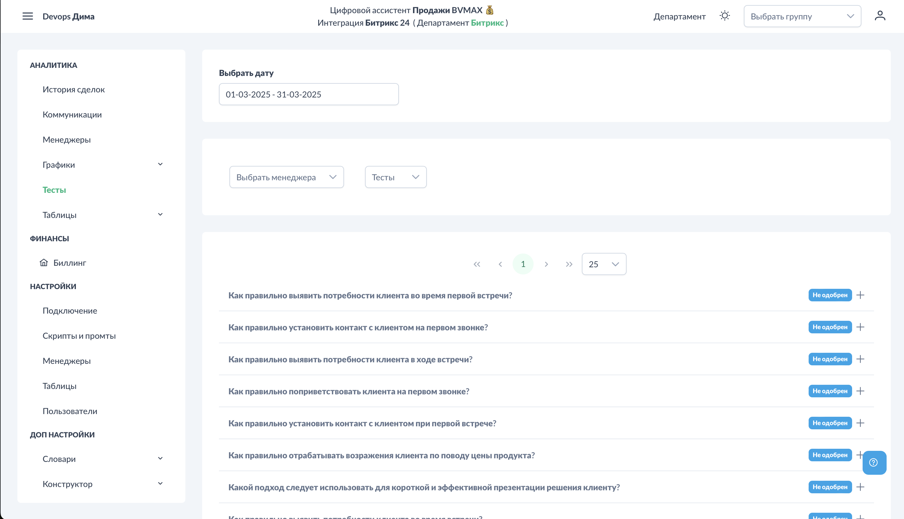
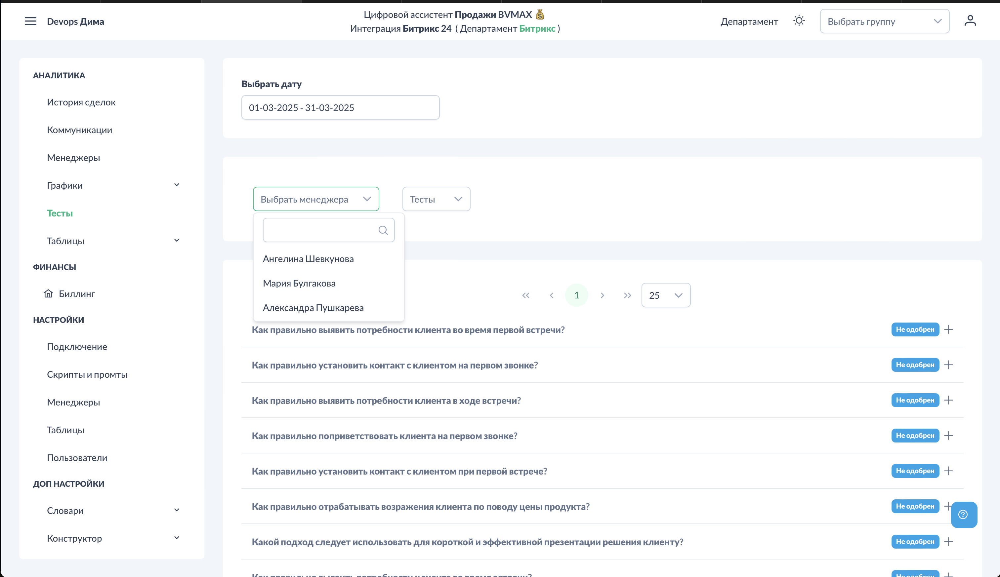

# Тесты

Система автоматически формирует обучающие тесты на основе ошибок менеджеров. Тесты отправляются в Telegram и помогают закрепить правильные навыки.

## Как работают тесты

!!! technical "Техническое"
    Процесс формирования тестов:

1. **Анализ ошибок** — в конце рабочего дня система собирает невыполненные этапы
2. **Приоритизация** — этапы с наибольшим количеством ошибок имеют приоритет
3. **Формирование вопроса** — ИИ создаёт тестовый вопрос на основе этапа скрипта
4. **Ожидание одобрения** — тест ждёт проверки руководителем
5. **Отправка** — после одобрения тест отправляется менеджеру в Telegram

## Доступ к разделу

!!! interface "Интерфейс"
    Перейдите в **Аналитика → Тесты**.

<figcaption>Тесты. Общий вид.png</figcaption>

## Фильтры

### По менеджеру

<figcaption>Тесты. Фильтр менеджеры.png</figcaption>

!!! interface "Интерфейс"
    Выберите менеджера для просмотра его тестов.

### По статусу

<figcaption>Тесты. Фильтр статусы.png</figcaption>

!!! interface "Интерфейс"
    Фильтрация по статусу теста:

- **Все** — все тесты
- **Ожидает одобрения** — требуют проверки руководителем
- **Одобрен** — готов к отправке
- **Отправлен** — отправлен менеджеру
- **Пройден** — менеджер ответил правильно
- **Не пройден** — менеджер ответил неправильно

## Просмотр теста

<figcaption>Тесты. Пример теста.png</figcaption>

!!! interface "Интерфейс"
    При клике на тест открывается:

- Вопрос
- Варианты ответов
- Правильный ответ
- Связь с этапом скрипта

## Редактирование теста

<figcaption>Тесты. Редактирование.png</figcaption>

!!! interface "Интерфейс"
    Руководитель может отредактировать:

- Формулировку вопроса
- Варианты ответов
- Правильный ответ

!!! technical "Техническое"
    Редактирование полезно, когда автоматически сгенерированный вопрос не совсем корректен или требует уточнения.

## Одобрение теста

<figcaption>Тесты. Одобрение.png</figcaption>

!!! interface "Интерфейс"
    Для отправки теста менеджеру:

1. Проверьте содержание теста
2. При необходимости отредактируйте
3. Нажмите галочку "Одобрить"

!!! technical "Техническое"
    После одобрения тест автоматически отправляется менеджеру в Telegram (если у него привязан аккаунт и он начал диалог с ботом).

## Повторение тестов

!!! technical "Техническое"
    Для лучшего закрепления материала один тест отправляется повторно:

- **На следующий день** — первое повторение
- **Через 3 дня** — второе повторение
- **Через неделю** — третье повторение
- **Через месяц** — финальное закрепление

Это основано на методике интервального повторения (spaced repetition).

## Требования для получения тестов

!!! technical "Техническое"
    Чтобы менеджер получал тесты:

1. **Создан пользователь** в разделе [Пользователи](../settings/users.md)
2. **Привязан к менеджеру из CRM** — система знает, чьи ошибки анализировать
3. **Привязан Telegram** — куда отправлять тесты
4. **Начат диалог с ботом** — менеджер нажал /start в @BVM_Assistant_Bot

## Статистика по тестам

Прогресс по тестам отображается в разделе [Аналитика - Менеджеры](../analytics/managers.md):
- Сколько тестов сформировано
- Сколько пройдено успешно
- Процент прохождения

## См. также

- [Настройки - Пользователи](../settings/users.md) — привязка Telegram
- [Аналитика - Менеджеры](../analytics/managers.md) — статистика по тестам
- [Шаблоны скриптов](../settings/scripts-templates.md) — этапы, на основе которых формируются тесты
